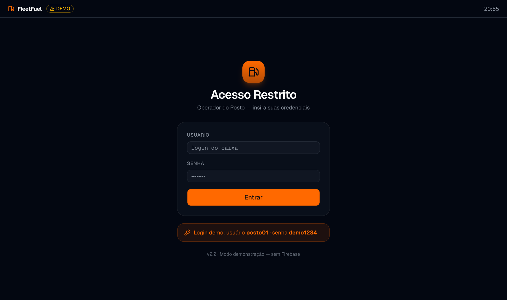

# posto-web — Operador do Posto (FleetFuel)

Sistema **web** do operador do posto (caixa) — o outro lado do fluxo de pagamento por
QR do FleetFuel (motorista escaneia → posto confirma). **Não é PWA** (web desktop-first),
seguindo o padrão de cores do `pwa-comboio` (laranja sobre navy).



## Stack

- **Next.js 16** (App Router) + **React 19** + **TypeScript** (strict)
- **Tailwind v4** + **shadcn** (radix-nova) + design system OKLCh (laranja, dark-mode-first)
- **Vitest** (unit) + **Playwright** (e2e)
- Sem service worker / offline / Dexie.

## Scripts

```bash
pnpm dev        # desenvolvimento
pnpm build      # build de produção
pnpm start      # serve o build
pnpm lint       # eslint
pnpm test       # vitest (unit)
pnpm test:e2e   # playwright (e2e; build + start na porta 3412)
```

## Variáveis de ambiente (`.env`)

```
NEXT_PUBLIC_API_URL=http://localhost:3000   # base da API NestJS
NEXT_PUBLIC_APP_ENV=homologacao              # homologacao | producao
```

## Login

A tela **"Acesso Restrito"** (`/`) autentica no backend NestJS via
`POST /user/auth/login` (mesmo endpoint do 360). Em sucesso, guarda `accessToken` +
dados do operador na sessão (`localStorage`) e vai para `/home`.

Só entra **operador com vínculo `posto`** (`user.vinculo === "posto"`); qualquer outro
vínculo é recusado com _"Este acesso não é de um posto."_. O acesso de cada posto é
cadastrado no 360 (tela de detalhes do posto). As demais telas do operador (confirmar
pagamento do QR) entram numa próxima etapa.

## Estrutura

```
app/            layout, page (login), home (placeholder), globals.css
components/
  ui/           base do design system (do comboio)
  auth/         app-header (marca+ambiente+relógio), login-screen
  providers/    SessionProvider
features/auth/  api (login real via /user/auth/login)
lib/            api/client, session, config/env, utils, design-system
e2e/            testes Playwright
docs/           spec, plano e screenshots
```
